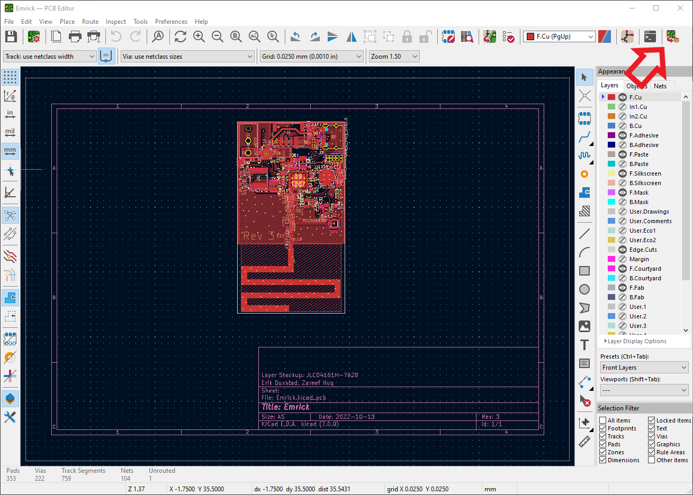
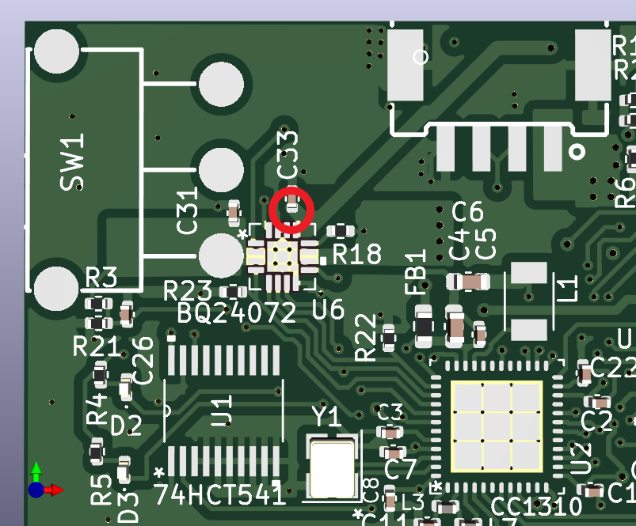
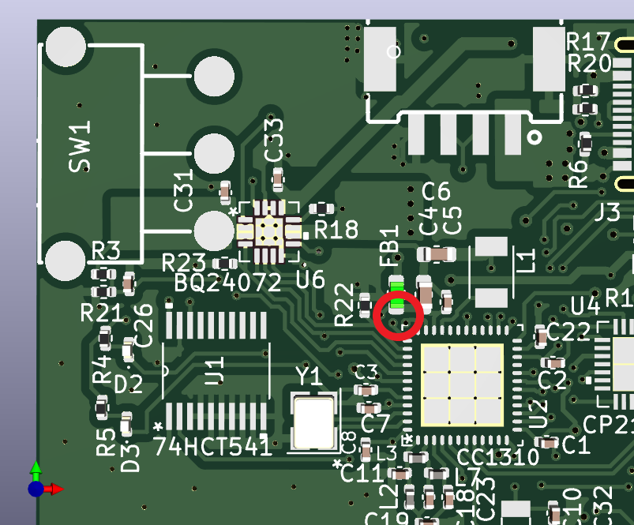
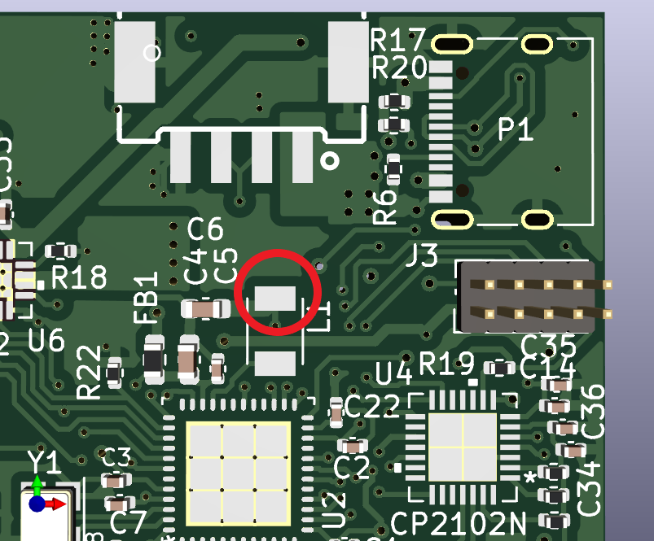
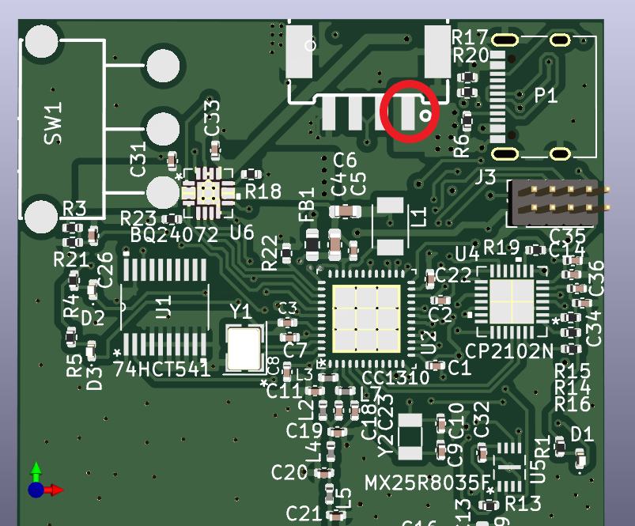

# Emrick Hardware
This folder contains the KiCAD project of the wearable light strip PCB. 
In the production folder are the gerber and placement files for the latest 
revision, generated from KiCAD.

## Generating PCB production files
This process is meant for creating production files that will be used with JLCPCB.
For a different manufacturer the process may be slightly different. 

1. Install the [Fabrication Toolkit](https://github.com/bennymeg/JLC-Plugin-for-KiCad) plugin. This automates the PCB fabrication process. 
2. Once you've verified that the board has no unexpected errors in the electrical rules check and that the silkscreen is correct (any labels/versions updated, etc), press the fabrication button to generate the gerber and placement files in the production folder. 

Note that this will also create a bill of materials (BOM) for the PCB. However, the JLCPCB part numbers are not currently added to schematic (there are [instructions here](https://jlcpcb.com/help/article/81-How-to-generate-the-BOM-and-Centroid-file-from-KiCAD)) so the latest BOM is kept in `bom.xls`. 
3. Update the BOM file in `bom.xsl` with any new components and their JLCPCB part numbers. 
4. Order the boards from JLCPCB. Select 'Yes' -> 'JLC04161H-7628' as the Impedance Control and Layer Stackup options respectively. This is to select a specific material layup to preserve the RF characteristics of the PCB. 

## Hardware troubleshoot
Well, you're worried you toasted a board. Here are the steps to make sure that the board is happy. Note that for software/peripherals there is a Smoketest program in the `software/cc1310` folder that will test the functionality of all of the peripherals. 

1. If connected to USB, verify that you are receiving 5V from the VBUS connection. You can use the USB port shielding as ground, and touch the other end of the multimeter to pin 1 of C33. This can vary a few tenths of a volt due to what device you are connected to and how much current you are drawing. 

2. Verify the supply voltages of the CC1310 microcontroller. This is taken from section 12 of the Hardware and PCB Design considerations [here](https://www.ti.com/lit/an/swra640g/swra640g.pdf). 
    1. Verify the output of the regulator is 3.3 volts (aka VDDS == 3.3) on pin 2 of FB1. This should be within a tenth of a volt. 
  
    2. Verify that VDDR == 1.68 on pin 2 of L1. This should be within a 100th of a volt.
  
    3. Verify that DCOUPL == 1.27 on pin 1 of C22. This should be within a 10th of a volt. 
  
If these voltages check out, it's pretty likely that the CC1310 should be working correctly. 

3. Now we can move on to the boosted 5V LED output. 
    1. Load a program that turns on the LED lights, like SPIWS. Don't actually connect a light strip. 
    2. Check that the voltage on pin 1 of J1 is stable at 4.95V or greater. Ideally very close to 5V,like 4.99V, since there is only the extremely small load of the multimeter across it. 
    

